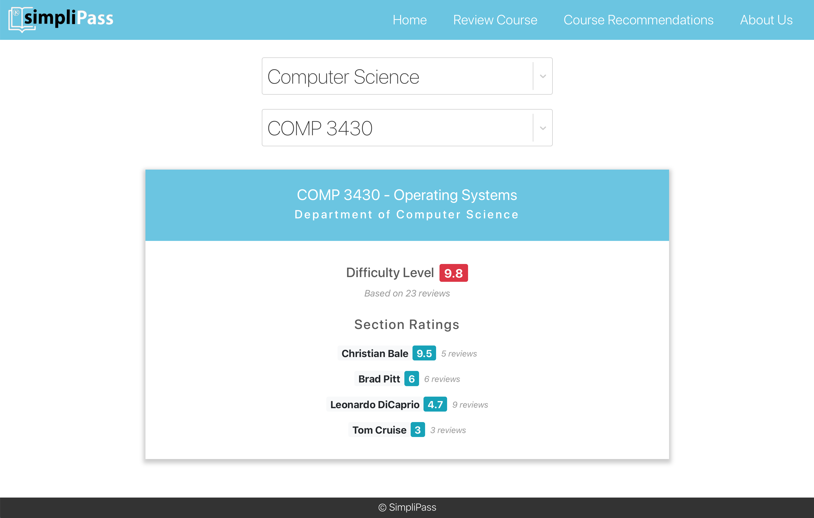
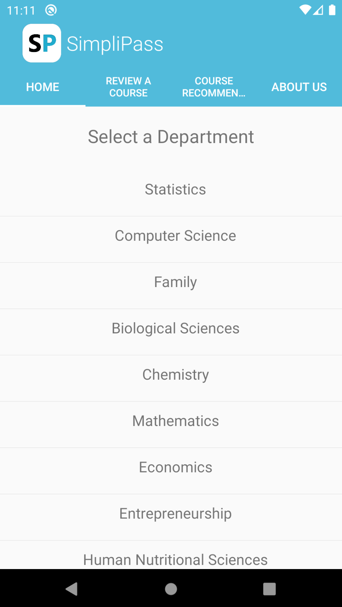
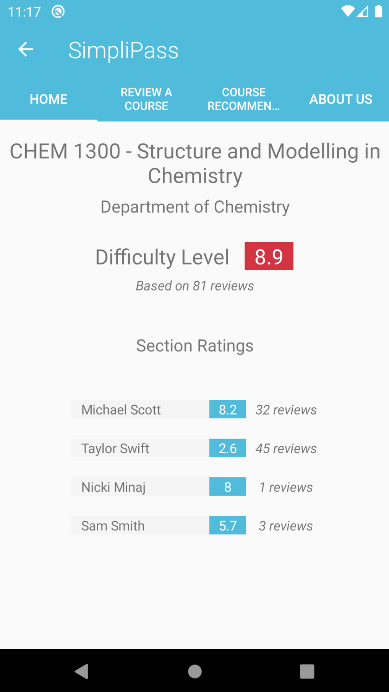
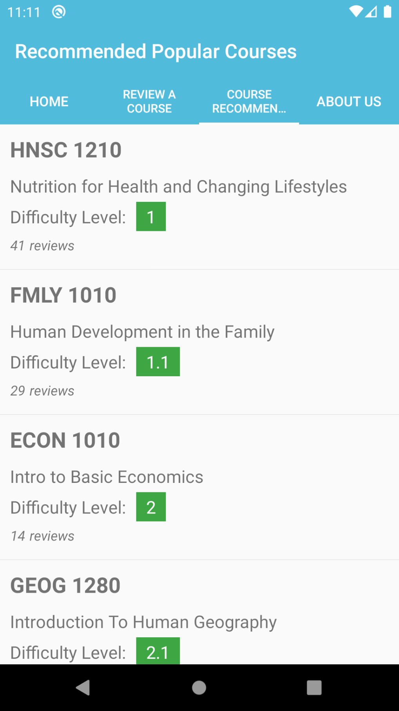

# SimpliPass

_Maximize your academic success through optimal course selections and reviews!_

  

## More Details

- [See Project Wiki](https://github.com/nahiyannaim/SimpliPass/wiki)

## Authors

- [Nahiyan Naim](https://github.com/nahiyannaim)
- [Sabit Rahman](https://github.com/sabitrahmaan)
- [Bohdan Parkhomchuk](https://github.com/bohdan-p)
- [Arsh Khokhar](https://github.com/arsh-khokhar)
- [Darshan Pandhi](https://github.com/darshanpandhi)
- [Owen Leduchowski](https://github.com/owenleduchowski)
- [Kin Leong](https://github.com/Waiikiin)
- [Grygoriy Bezshaposhnikov](https://github.com/SSmade)
